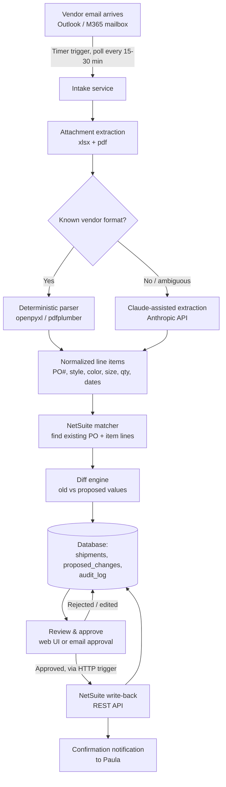

# PO Update Automation — System Architecture

**Project:** Automate NetSuite Purchase Order updates (quantity, expected/updated/override receipt dates) from vendor shipping documents.
**Owner:** Paula (Supply Chain Manager) — end user / approver. Kiko — build owner.
**Status:** Scoping doc for handoff to Claude Code implementation.
**Last updated:** 2026-08-10

---

## 1. Problem statement

Paula records purchase orders in NetSuite when they're placed. Vendors (e.g., Inprotex, via freight forwarders like UPS Supply Chain) later send shipping update emails with a packing slip (multi-tab Excel) and a shipping advice (PDF) attached, once goods actually ship. These documents contain the real, final quantities and shipping dates per PO/style/color/size — which often differ from what was originally entered in NetSuite.

Today Paula manually reads these documents and edits each NetSuite PO by hand, at the item-line level:

- **Quantity** (within the specific PO)
- **Expected Receipt Date**
- **Override Expected Receipt Date**
- **Updated Receipt Date**

Goal: automate the reading and matching, leave a human-reviewed approval step before anything writes to NetSuite, and (ideally) trigger off of forwarded/received vendor emails rather than manual file upload.

## 2. What we've already validated (this session)

- Built and tested `parse_packing_slip.py` against a real vendor file (`0626建躍空運成衣 (SD-219國外)Invoice_Packing.xlsx`, `PACKING` tab) and a real shipping advice PDF. It correctly extracts, per PO#/style#/color/size: quantity, plus shipment ETD/ETA, HAWB, and invoice number.
- Cross-checked all 77 extracted line totals by hand against the vendor's own summary email — 100% match.
- Attempted to connect Cowork's NetSuite sandbox connector. Diagnosed (see §6) that the account's OAuth 2.0 integration record is scoped to a proprietary "NetSuite AI Connector Service" permission that isn't assignable to custom roles in this account — blocked pending NetSuite admin/support action.
- Decided on required guardrails with Paula/Kiko: **sandbox before production**, and a **permanent (not temporary) lightweight human review/approve step** before any NetSuite write.

## 3. Two architecture options

### Option A — Cowork-native (what we prototyped with)

Uses Claude's built-in Cowork connectors (NetSuite, Microsoft 365/Outlook), Cowork scheduled tasks for polling, and Cowork artifacts for a review screen. No separate hosting.

**Pros:** nothing to host or maintain; reuses OAuth sessions already set up; fastest path to a working demo; zero incremental infrastructure cost.

**Cons:** scheduled tasks run as discrete agent invocations (no persistent process), so there's no true real-time email trigger — only periodic polling; no dedicated database/audit trail beyond Cowork's memory and task list; review UI is limited to what a Cowork artifact (sandboxed HTML) can do; tied to Cowork's session/rate-limit model; harder to hand off to someone else to operate independently of a Claude Desktop session; the NetSuite connector's OAuth setup is locked to an interactive, human-in-the-browser login flow that has to be re-authorized periodically (refresh token validity is 48 hours on the integration record we inspected) — not ideal for something meant to run unattended.

### Option B — Standalone agentic service via the Anthropic API (recommended)

A small, purpose-built backend application (built with Claude Code) that owns the whole pipeline: email intake, parsing, NetSuite read/write, review workflow, and an audit trail. Claude (via the Anthropic API) is used inside the pipeline for the steps that need flexible judgment — not for the whole app.

**Pros:** true automation is possible (webhook-triggered, not just polled); persistent database for audit/history/rollback; direct, scriptable NetSuite REST integration authenticated via machine-to-machine OAuth (no repeated interactive browser logins — this specifically sidesteps the exact problem we hit with Cowork's connector, see §6); a small dedicated review UI (or even simpler, an email-approval flow) that isn't constrained by Cowork's sandboxed artifact environment; can be extended to more vendors, more document formats, and more NetSuite fields over time without depending on a chat session; runs unattended on a schedule or event trigger.

**Cons:** real engineering effort (see build plan doc); needs a small amount of hosting infrastructure and secret management; someone has to own monitoring/maintenance once it's live; slightly more moving parts to get right initially (Graph API app registration, NetSuite Integration record, database schema).

### Recommendation

Build **Option B**. Option A was the right way to validate the parsing logic and NetSuite requirements cheaply (which we did), but a system a supply chain manager will rely on daily shouldn't be dependent on someone having a Claude Desktop session open, and shouldn't need re-authorizing a browser OAuth flow periodically. The Anthropic-API-based service is the version worth actually running in production.

## 4. Recommended architecture (Option B)



### 4.1 Components

**Intake service**
**Decided by Paula (2026-08-10): direct app-only Graph API access to her own mailbox — not a shared "PO updates" mailbox.** Registers an Azure AD (Entra ID) app with Microsoft Graph `Mail.Read` (app-only) permission against Paula's own inbox directly. Simpler than the shared-mailbox alternative: no forwarding rule for her to maintain, no separate mailbox for IT to provision. **Confirmed volume is 10–20 shipment emails/week — polling is sufficient and is the recommended approach; a real-time Graph webhook subscription is not worth building for this volume** (it adds a public HTTPS endpoint and subscription-renewal logic for a use case where a 15–30 minute delay is a non-issue). A scheduled job checks for new messages in a designated folder on that interval. Revisit only if actual volume grows well beyond this range.

**Parsing layer**
**Confirmed by Paula: every vendor sends a completely different packing slip layout.** That rules out "one deterministic parser per vendor" as the primary strategy — it doesn't scale, and every new vendor would block on new engineering work. Build order, revised accordingly:
- **Primary path — Claude-powered extraction**: send the sheet's structure (cell grid, not an image) to Claude with a prompt describing the target schema (PO#, style, color, size, qty), and have it return structured JSON. This is the actual "agentic" piece, and it's now the default path for essentially all vendors, not an edge-case fallback.
- **Fast path for Inprotex specifically**: reuse `parse_packing_slip.py`, already built and validated against a real Inprotex file (100% match against the vendor's own summary email). Free, fast, no LLM call — keep it for this one known-good format, but don't invest further in writing more vendor-specific deterministic parsers beyond it.
- Any row the Claude-powered extractor isn't confident about should route to the review step flagged as low-confidence rather than being silently guessed — same "never fail silently" principle as unmatched PO lines (§4.1 Matcher).
- **Decided by Paula (2026-08-10): the packing list is the only authoritative document. Final inspection reports (or any other QC document) are never a data source, even when they contain data the packing list lacks.** No fallback to the inspection report, ever, even when it has the needed field.
- **CORRECTION 2026-08-10 (same day, follow-up):** the "Symmetry's packing list has no size breakdown" finding from earlier today was based on a non-representative sample. Paula's own words: **"Symmetry sends a packing list, and it's usually included in the same batch of documents with the invoice and inspection report. It does include the size breakdown, I can forward one to you if it wasn't in the initial example that I sent."** The file tested (`SD #1720, 1721 INVOICE, PACKING LIST.pdf`) was evidently the invoice, or an incomplete/atypical set — not Symmetry's normal packing list. **Action needed before this is fully validated: get the actual packing list document from Paula for this same shipment (PO 1721 / W600001) and re-run the extractor against it.** Until that happens, don't treat "Symmetry's packing list lacks size data" as a confirmed vendor characteristic — it was an artifact of testing against the wrong file. The `NEEDS_ATTENTION`-when-unresolvable behavior below stays as a permanent defensive default for *any* vendor's packing list that genuinely lacks size detail, but it's a fallback for an edge case now, not the expected outcome for Symmetry specifically. **Consequence, unchanged as a general rule: when a vendor's packing list doesn't resolve to individual style-colour-size lines, that shipment must be flagged `NEEDS_ATTENTION` for Paula to enter manually — never inferred from a non-packing-list source, and never proportionally split across sizes as a guess.**

**Matcher**
Calls NetSuite's REST Record API to look up each parsed PO number, then aligns parsed (style, color, size) to the PO's existing item lines. **Match key confirmed live against sandbox (§6):** exact match on `custcol_sd_tmpl_style` (or equivalently `custcol_cmo_parentitem.refName`) for style, plus `custcol_product_color.refName` and `custcol_product_size.refName` (size-normalized — see §6) for color/size. Prefer these dedicated fields over parsing the Item display name (e.g. "M120246 : M120246-Waterman Polo-TID-S") — the display name is still useful for human-readable logging and as a cross-check, but the exact-match custom fields are the authoritative key. `matcher.py` already implements this.

**Diff / staging**
Computes proposed new Quantity, Expected Receipt Date, Override Expected Receipt Date, and Updated Receipt Date per line, compared to what's currently in NetSuite. Writes a `proposed_changes` record per line with status `PENDING_REVIEW`. Nothing touches NetSuite yet.

**Review & approve**
Human-in-the-loop step, permanent by design (per Paula's and Kiko's decision this session). Two viable implementations, roughly in order of build effort:
- *Simplest*: an email digest with an approve/reject link per shipment (or per line), no custom UI to build.
- *Small dashboard*: a lightweight internal web page (e.g., a single FastAPI + HTMX or Next.js page) listing pending shipments with a diff table and Approve/Reject/Edit buttons — closer to what the sample spreadsheet we generated this session (`Proposed_PO_Updates_SD-219.xlsx`) shows, but interactive and persistent instead of a one-off file.
- **Decided by Paula (2026-08-10): receipt dates are never auto-proposed.** She determines Expected Receipt Date / Updated Receipt Date herself — "it's a receiving date and includes buffers," not the vendor's port ETA or any other vendor-stated date. This means the simple approve/reject-a-computed-value pattern **does not work for the date fields specifically**, even though it's fine for Quantity. The review step needs an input, not just a decision: show the vendor's raw ETD/ETA as reference only (clearly labeled as reference, not a proposal), and require Paula to type in the actual receipt date before the write-back can proceed. An email-link flow needs a lightweight form for this (even a simple "reply with the date" or a linked mini-form), not a bare Approve button, for any shipment carrying a date field. Quantity can still move through a plain approve/reject, since that value is decided by policy, not by Paula's judgment.

**NetSuite write-back**
On approval, calls NetSuite's REST API (or a SuiteScript RESTlet, if the standard REST record API doesn't cleanly support editing item-line sublists — needs validation once access is restored) to apply the approved values. Records the NetSuite response (success/error) back to the audit log.

**Audit log / database**
Every shipment processed, every proposed change, who approved it and when, and the NetSuite write result — stored durably (Azure SQL Database, serverless tier — see §4.2). This is something Option A can't really give us.

**Notifications**
Confirms success/failure back to Paula (and optionally Kiko) — email or Teams message.

### 4.2 Tech stack (decided 2026-08-05)

| Layer | Choice | Why |
|---|---|---|
| Backend | Python (FastAPI) | Parsing code (openpyxl, pdfplumber) is already Python; Anthropic's Python SDK is first-class |
| **Hosting** | **Azure Functions, Consumption (serverless) plan** | See "Hosting & trigger decision" below |
| **Trigger** | **Timer trigger (poll every 15–30 min) + HTTP trigger (approval-link clicks)** | See below |
| Email intake | Microsoft Graph API | Straight Down already uses M365/Outlook |
| NetSuite | SuiteTalk REST Web Services | Confirmed available on the account; standard REST API handles the sublist writes directly, no RESTlet needed (§6) |
| LLM | Anthropic API (Claude) | Flexible-format extraction, human-readable change summaries |
| Database | **Azure SQL Database, serverless compute tier** | See below |
| Review UI | Email-approval for v1 (approve/reject link per shipment) | Keep v1 scope small; matches the HTTP-trigger design below |

#### Hosting & trigger decision

**Hosting: Azure Functions, Consumption plan.**
Straight Down is already an M365/Entra ID shop — that's a hard requirement anyway for the Graph API mailbox access this pipeline needs, so Azure hosting doesn't add a new vendor relationship. Consumption plan means Straight Down pays per execution, not for an always-on server: at 10–20 shipments/week plus a poll every 15–30 minutes, the monthly compute cost is a few dollars, and there's no VM to patch, size, or leave running idle. No server to maintain is also the easiest line to defend to a non-technical approver.

**Database: Azure SQL Database, serverless compute tier** (auto-pauses when idle, auto-resumes on the next query).
Azure Functions' compute is stateless and ephemeral between invocations, so a locally-stored SQLite file isn't a good fit — there's no durable disk to keep it on between runs. A small managed relational database matches the three-table data model in §5 (`shipments` / `proposed_changes` / `audit_log`) without any redesign, and the serverless compute tier keeps cost near-zero at this volume since it pauses when nothing is happening.

**Trigger design — two triggers in one Function App:**
1. **Timer trigger**, every 15–30 minutes: polls the mailbox via Graph API for new vendor shipping emails, runs parsing → matching → diff, and writes `PENDING_REVIEW` rows plus sends Paula a review email.
2. **HTTP trigger**: handles the "Approve" / "Reject" link click from that review email, then executes (or skips) the NetSuite write-back.

This two-trigger split avoids building a persistent server process just to keep a webhook connection alive, while still giving an instant response to Paula's click rather than waiting for the next poll cycle.

**Secrets convention (established during Phase 1):** the M2M private key lives at `C:\Users\<user>\.po-agent\keys\` — deliberately *outside* the `PO Agent` project folder, because that folder is OneDrive-synced. A private key placed inside it would sync to Microsoft's cloud and be inherited by anyone the folder is ever shared with, which is not acceptable for a credential that authenticates as a NetSuite service account. Only the public certificate (safe to expose) gets uploaded to NetSuite; the private key never leaves the local machine. Keep this convention for any future secrets this project accumulates (Graph API app credentials, Anthropic API keys, etc.) — nothing that authenticates should live inside the synced folder.

## 5. Data model (draft)

```
shipments
  id, source_email_id, vendor_name, invoice_no, hawb, mawb,
  etd, eta, received_at, status

proposed_changes
  id, shipment_id, po_number, item_id (NetSuite internal id, once known),
  style_number, color, size,
  current_quantity, proposed_quantity,
  current_expected_receipt_date, proposed_expected_receipt_date,
  proposed_override_flag, proposed_updated_receipt_date,
  status (PENDING_REVIEW | APPROVED | REJECTED | APPLIED | FAILED)

audit_log
  id, proposed_change_id, actor (system | Paula | Kiko),
  action (parsed | matched | approved | rejected | applied | error),
  detail, timestamp
```

## 6. NetSuite integration notes (lessons learned this session — important for whoever builds this)

- The account has both **sandbox** (`1321665-sb2`) and **production** instances — build and test everything against sandbox first.
- Custom roles need: `Transactions > Purchase Order` = Edit, `Lists > Items` = View, `Lists > Vendors` = View, `Setup > REST Web Services` = Full, and `Setup > Log in using OAuth 2.0 Access Tokens` (checkbox, confirmed required for M2M specifically — see below).
- **FINAL CONFIRMED PERMISSION SET for `PO Update Automation (M2M)` (2026-08-12)**, after the collection-query investigation closed:

  | Subtab | Permission | Level | Why |
  |---|---|---|---|
  | Transactions | Purchase Order | Edit | read + write the PO item sublist |
  | Lists | Items | View | resolve item/style references |
  | Lists | Vendors | View | read the PO's vendor |
  | Setup | REST Web Services | Full | use the REST API at all |
  | Setup | Log in using OAuth 2.0 Access Tokens | (checkbox) | required for the role to be *selectable* in M2M setup |
  | Setup | **Custom Lists** | View | read `customlist_psgss_product_size` (the size value list) |
  | Reports | **SuiteAnalytics Workbook** | **Edit** (View untested) | **gates all collection `GET`, `?q=` filtering and SuiteQL** |

  **Why SuiteAnalytics Workbook is required, and why that is not obvious:** it is the single gate on *every* record COLLECTION endpoint — `GET /purchaseOrder?limit=1`, `?q=` filtering, and `/query/v1/suiteql` — while **single-record `GET`/`PATCH` by internal id is not gated by it at all**. So the role could read and write PO line items perfectly while every list/search/query call returned `400 USER_ERROR`. That asymmetry is the diagnostic signature: by-id works, collections don't. Confirmed as the sole cause by bisect — `Lists > Subsidiaries` and `Lists > Accounts` were added in the same batch, then removed, and collection GET still returns 200 without them.

  **Why Custom Lists is separate, and three things worth knowing:** it lives on the **Setup** subtab (not Lists, despite governing what are called lists), it is **not** `Custom Record Entries` (that governs custom *records*), and custom lists carry **no per-list role restriction** — granting it exposes every custom list in the account, not just the size list. Unlike the collection failures this one names itself: `403 INSUFFICIENT_PERMISSION`, *"You need the 'Custom Lists' permission"*.

  **Open least-privilege check before production:** SuiteAnalytics Workbook is on at **Edit**; whether **View** suffices is untested. The pipeline only reads. Test View and downgrade before the Phase 4 cutover.

  **Tried and NOT required for collection access** — two tiers of confidence, kept distinct on purpose:
  - *Confirmed unnecessary:* `Lists > Subsidiaries`, `Lists > Accounts` (added then removed, still 200), and the `Web Services Only Role` checkbox (confirmed harmless in **either** state, for both authentication and the by-id write path; unchecking it did not restore collection access).
  - *Probably unnecessary, but the elimination is not sound:* `Transactions > Find Transaction` (View) and `Lists > Perform Search`. Both were tested and reported as ruled out, but **neither was verified as actually saved onto the role** — the exact failure mode that hid SuiteAnalytics Workbook for five probe cycles (see RUNBOOK §8). Since SuiteAnalytics Workbook alone is sufficient, neither is needed regardless; just don't cite these two as proven-irrelevant.
- **"Web Services Only Role" depends on which OAuth grant type you're using — these are opposite recommendations, don't conflate them:**
  - **Interactive Authorization Code Grant** (what Cowork's connector uses): leave it **unchecked**. This flow requires an actual browser login screen, and checking this box blocks that login entirely — this is what caused the failures we hit this session.
  - **Client Credentials (M2M) grant** (what the standalone build should use, see below): there's no browser login at all — authentication happens via a signed JWT assertion, never an interactive session. **Confirmed 2026-08-04, empirically tested:** checking "Web Services Only Role" on the "PO Update" role does NOT break M2M authentication or the write path — `test_phase1_writeback.py` passed identically with it checked. **Keep it checked** as the hardened, confirmed-correct configuration for this role going forward.
- **Confirmed finding (2026-08-04):** the Setup permission **"Log in using OAuth 2.0 Access Tokens"** is required for M2M specifically — without it, the role doesn't even appear as a selectable option on NetSuite's OAuth 2.0 Client Credentials (M2M) Setup screen. This wasn't part of the original permission list (worked out against the interactive flow) and was deliberately left off at first to test whether it was actually needed — it is. It's still a login permission, not a data permission, so it doesn't widen what the role can read/write, only whether it can authenticate via this flow at all. Now folded into the standard role permission list above as the fifth required permission.
- **M2M requires a valid (entity, role, integration) triple for the certificate mapping** — NetSuite's Client Credentials grant ties a certificate to an existing employee record, not just a role. **Confirmed: a dedicated new Employee record for this consumes a paid NetSuite user license**, which contradicts the build plan's original $0-incremental-cost assumption. **Decision: don't create a new employee — attach the "PO Update" role to an existing, already-licensed employee instead** (Kiko's own). The dedicated-employee idea was only ever a cleaner-audit-trail nice-to-have, not a technical requirement of the M2M flow itself. Trade-off accepted: NetSuite's own employee-identity audit trail won't distinguish this pipeline's automated writes from Kiko's manual ones — but the pipeline's own `audit_log` table (§5, under the application's own control) can and should make that distinction itself (`actor` = "system" vs. "Kiko"), which is arguably more reliable anyway. Revisit a dedicated licensed service account later if audit clarity becomes more important once this runs in production.
- The existing "Claude AI" integration record in this account is configured as an **OAuth 2.0 Authorization Code Grant, Public Client**, scoped only to a proprietary **"NetSuite AI Connector Service"** permission — not "REST Web Services." That permission isn't currently assignable to custom roles in this account (not found in the role permission picker), which is why every role we tried (Administrator and a purpose-built custom role) failed authorization identically. This is specific to *Cowork's* pre-built NetSuite connector, not a constraint on a custom-built integration.
- **For the standalone build, don't reuse that integration record or grant type.** Create a *new* NetSuite Integration record scoped explicitly to `REST WEB SERVICES`, using the **OAuth 2.0 Client Credentials (Machine-to-Machine) grant** — visible as a checkbox on the Integration record we inspected — tied to a dedicated, least-privilege role (the "PO Update" role permissions above). M2M auth uses a certificate instead of an interactive login, so there's no browser consent screen, no "choose a role" failure mode, and no repeated re-authorization — well suited to an unattended, scheduled service. This avoids the entire class of problem we hit this session.
- **Resolved this session, live-tested in sandbox:** the standard NetSuite REST Record API *does* support editing Purchase Order item-line sublist fields directly — no RESTlet needed. Confirmed via `ns_getRecordTypeMetadata('purchaseOrder')` (none of the four target fields are read-only) and a live round-trip test against real sandbox PO 8489541 (PO# 1662, line 18 / M120246-TID-3X): updated `quantity` (2→99), `expectedReceiptDate` (2026-07-15→2026-06-27), `custcol_override_expected_receipt` (false→true), and `custcol_sd_updatedreceiptdate` (null→2026-06-27) in a single `PATCH`-style call, read the record back to confirm, then reverted all four values to their originals. Confirmed field names/types for the write-back implementation:
  - `quantity` — number
  - `expectedReceiptDate` — string, ISO date (`YYYY-MM-DD`)
  - `custcol_override_expected_receipt` — boolean, custom field (title "Override Expected Receipt")
  - `custcol_sd_updatedreceiptdate` — string, ISO date, custom field (title "Updated Receipt Date")
  - Target a specific line with its `line` number (integer, from the existing record) inside `item.items[]`.
- **Also resolved:** style-color-size is **not** a matrix item with variants — it's a separate child Item record per SKU (`matrixType: "CHILD"`, with a `custcol_cmo_parentitem` pointing back to the parent style, e.g. style `M120246` → children `M120246-Waterman Polo-TID-S`, `...-M`, `...-L`, etc.). `custcol_product_color` and `custcol_product_size` are reference fields (id + refName) on each line, not free text — match on `refName`, not on parsing the item display name.
- **New finding, needs handling in the matcher:** NetSuite's canonical size labels don't match the vendor's labels one-to-one. NetSuite stores `2X` / `3X` (confirmed via `custcol_sd_tmpl_size_run: "S,M,L,XL,2X,3X"` on a real item), while Inprotex's packing slip uses `XXL` / `XXXL` for the same sizes. `matcher.py` needs a size-code normalization step before matching, or it will silently miss-match or false-flag every 2XL/3XL line as `NEEDS_ATTENTION`. **Already fixed in `matcher.py` (`SIZE_ALIASES`).**
- **CFO-vs-least-privilege-role caveat: now fully closed (2026-08-04).** The original live write test (above) ran under the CFO role via Cowork's interactive connector — a temporary workaround, not proof the actual least-privilege role could do the same write. That question is now answered: **Claude Code re-ran the identical write/verify/revert test (PO 8489541, line 18) authenticated via real M2M/JWT under the actual "PO Update" role, and it passed.** All four fields (`quantity`, `expectedReceiptDate`, `custcol_override_expected_receipt`, `custcol_sd_updatedreceiptdate`) wrote correctly with no silent discards, verified by reading each field back individually, then reverted cleanly. No field-level access restriction exists on either custom column for this role. This closes the last open validation step in this section — Phase 1's core exit criterion is met.
- **New finding: NetSuite doesn't reliably use HTTP 403 for permission refusals.** A genuine permission-denied response came back as **HTTP 400** with body `USER_ERROR: Your current role does not have permission to perform this action.` — not 403. Any error-handling/classification logic in the write-back component (and anywhere else calling NetSuite's REST API) needs to check for this specific error shape, not just HTTP status codes, or permission problems will be misclassified as generic request errors.
- ~~**New finding, blocks Phase 2's PO-number-to-internal-id resolution**~~ **RESOLVED 2026-08-12 — the missing permission was `Reports > SuiteAnalytics Workbook`.** See the permission table above for the full reasoning and the diagnostic signature. Collection `GET`, `?q=` filtering and SuiteQL are all gated by that one permission; by-id `GET`/`PATCH` never was.
- **A printed PO number is not a tranId (2026-08-12).** Vendors print the bare number; NetSuite stores `PO0001662`. `?q=tranId IS "PO0001662"` and the unquoted form both return `200` with `totalResults=1` (id `8489541`) — quoting is optional and neither form is preferred. `?q=tranId IS "1662"` returns `200` with `totalResults=0`: it executes correctly and matches nothing, which a naive caller misreads as "PO not found". Across the eight real documents every rendering carries the bare number (`PO#1662`, `PO NO : 1720`, `PO NO  :1720`, `PO NO. : 1721`, bare `1720` in a table cell) and **not one uses NetSuite's stored form** — so the transformation is extract digits → zero-pad → prefix, derived from Setup > Company > Auto-Generated Numbers rather than inferred from one sample. Full prerequisites and the extraction risk (a bare four-digit number needs column-header context; carton counts and quantities look identical to a page-wide regex) are in RUNBOOK §6.
- **SuiteQL removed from the resolution path (2026-08-12).** `resolve_po_internal_id()` previously fell back to SuiteQL after the two `?q=` forms. That fallback was **deleted**: it sent `{"q": "... tranid = ?", "params": [...]}`, and NetSuite's SuiteQL REST endpoint does not support parameter binding, so it returned `400 INVALID_CONTENT` — dead code that failed misleadingly, and which looked like a second strategy being tried while the `?q=` path was blocked. It was **not** replaced with string interpolation. `NetSuiteConfig.suiteql_url` is retained (SuiteQL is available to this role under the same SuiteAnalytics Workbook permission) with the parameter-binding limitation documented on it. `last_lookup_strategy` recording is unchanged.

### 6.2 Design constraints discovered by testing (2026-08-12)

Settled constraints, each found by measurement rather than design review. Later phases must respect them.

- **Row identity is the canonical key, never a digest of the whole row.** Verbatim display text varies between runs by design — the extractor may render a colour `NEW INDIGO` on one run and `NEW  INDIGO` on the next, and the pipeline preserves what was printed. In a five-run comparison, 6 of 25 rows differed in displayed text while keys, quantities, counts and order were identical. A row-digest idempotency check on `proposed_changes` would see spurious changes on every re-parse. Key on `canonical.py`.
- **The confidence signal is currently inert for triage.** `needs_review` was `True` on all four real documents, including those later hand-verified as flawless. A flag that always fires carries no information, so Phase 3 must not build its review queue on it as-is. It is **uncalibrated rather than proven safe**: zero errors were observed across 20/20 hand-verified line items, so the false-negative rate is unmeasured, not zero.
- **A shipment is not 1:1 with a PO.** One Inprotex sheet interleaves **six** POs (1640/1645/1650/1662/1667/1704); the Symmetry set spans two. So `shipments`/`proposed_changes` (§5) must model one email spanning many POs; the Phase 3 **approval unit** (per PO, per shipment, or per line) must be chosen deliberately; and write-back needs **partial-failure semantics** — one approval can mean six PO writes and the fifth can fail. What the audit log records, and what Paula sees, when three succeeded and one didn't must be decided before the write path is wired.

## 6.1 Business logic questions — Paula's answers (2026-08-10)

- **Which vendor date maps to which NetSuite field, and is there a transit buffer? RESOLVED, and now built.** Paula: **"I will determine what date to put into NetSuite, we don't use the port arrival date or anything that the vendor advises. It's a receiving date and includes buffers."** Implemented 2026-08-11: `ProposedChange` has no `proposed_expected_receipt_date` field at all — its absence is the enforcement mechanism, not just a convention. Vendor dates live in `vendor_etd`/`vendor_eta`, surfaced as reference only. `to_netsuite_fields(include_dates=True)` raises `DateNotConfirmed` until `confirm_receipt_date()` is called by a human — verified directly in `demo_matcher.py`'s output. Quantity-only writes are unaffected.
- **Re-shipment / split-shipment and over-shipment semantics. RESOLVED for the over-ship case, now built. Still open for true multi-batch shipments.** Paula: **"the packing list is the correct document to use, the PO will have the original quantity that I ordered and then when production is complete, there are always extra units that we accept."** Implemented: replace semantics, and over-shipment produces a plain `PENDING_REVIEW` with no attention flag — verified against a 500-shipped-vs-100-ordered case. **Still not explicitly confirmed:** whether a PO shipping in two genuinely separate batches, weeks apart, has the second batch's quantity replace the current NetSuite value or accumulate. The code currently replaces. Low urgency, worth a quick confirmation before Phase 3.
- **Lines present in NetSuite but absent from a given packing slip. RESOLVED 2026-08-10, now built.** Paula: routine batch shipping, not cancellation — assume "not part of that shipment." Implemented: no record is created at all for these lines, not even `NO_CHANGE` — `unmatched_netsuite_lines()` lists them for visibility only. Attention flags are now reserved for a vendor line with no NetSuite counterpart, low-confidence extraction, or a shipment needing manual entry — not for routine partial shipments.
- **Lines present in NetSuite but absent from a given packing slip — cancelled, or just not in this shipment? RESOLVED 2026-08-10.** Paula's answer: **"not all the styles on it ship at once so it's very likely that the packing list will only cover a few styles on the PO. The rest will be included in another shipment. If there is a style on the PO but not on the packing list, then assume it was not a part of that shipment."** Confirms the safe default was correct — leave the line untouched, never auto-cancel or zero it — but also confirms this is the **normal, expected case**, not a rare edge case: a PO commonly ships in batches, and most shipments will only cover a subset of a PO's styles. **Design consequence: don't surface this as an urgent `NEEDS_ATTENTION`-style flag** the way a genuine mismatch would be — treat it as ordinary, silent no-op (no change proposed for that line) rather than something that interrupts Paula's review with a flag on every shipment. Reserve real attention-flags for things that are actually surprising, not for the routine multi-batch case.
- **NEW, resolved 2026-08-10 — inspection reports are never a data source.** Paula's answer to whether she uses inspection reports for this purpose: **"No, not for this purpose."** Combined with the packing-list-only decision in §4.1, this closes the "is a QC document authoritative" question from §7 firmly: no, never, regardless of what data it happens to contain.

## 7. Open questions / assumptions to confirm before or during build

- ~~Approximate shipment/email volume per week~~ **Answered by Paula:** 10–20 shipment update emails per week. This is low enough that simple polling (e.g., every 15–30 minutes via Graph API) is sufficient — a real-time webhook subscription is not worth the added complexity (public endpoint, subscription renewal) at this volume. Build Phase 2 accordingly; revisit only if volume grows substantially.
- ~~Is style-color-size one Item record per SKU in NetSuite, or one Item with matrix variants?~~ **Resolved and independently confirmed twice** — once via live NetSuite sandbox testing (§6), and again directly by Paula: "NetSuite has style/color/size as one item. The format is `W630010:W630010-Kemble Fleece Jacket-COC-XS`" — matching exactly the `STYLE : STYLE-Name-COLOR-SIZE` pattern the matcher already assumes.
- Who else, besides Paula, should be able to approve changes (e.g., backup approver when she's out)?
- ~~Do other vendors send packing slips in meaningfully different layouts than Inprotex's?~~ **Answered by Paula: yes — every vendor's packing slip is a completely different layout.** See the revised Parsing layer section in §4.1 above — this moves the Claude-assisted extractor from "fallback" to "primary path."
- ~~NEW FINDING 2026-08-10 — the "packing slip + shipping advice" document-sourcing assumption does not hold~~ **RESOLVED 2026-08-11 — Symmetry re-tested against the real packing list, fully validated.** Paula sent the actual documents (`SD Actual Packing Covering...pdf` and the carton-level `SD Actual Packing...pdf`) — both extract cleanly, agree with each other exactly (25 style/colour/size keys, 1669 units, matching the printed grand total), and match the previously-seen inspection-report figures used only as a consistency check. The earlier "no size breakdown" finding is confirmed to have been an artifact of testing the invoice, not a real vendor limitation — independently verified against the PDF's own column coordinates, including the two trickiest cases (a colour with no XS column populated, a colour whose data stops at L with nothing beyond). **A real bug surfaced by the re-test, now fixed:** the carton-level file's headers print once on page 1 while carton rows continue onto page 2 — sending pages to the extractor separately silently produced a partial result (1128 of 1669 units) on the first attempt. Fixed by sending all pages in one call, re-sending page 1 as context if a document needs to be split for budget reasons. **This is exactly why the cross-check between the summary and carton-level documents was worth building, not redundant** — a single-document test would have passed a plausible-looking wrong answer.
  - **Attachment triage, built and tested against the real six-attachment Symmetry email** (`attachment_classifier.py`): filenames are not a reliable signal — `SD #1720, 1721 INVOICE, PACKING LIST.pdf` says "packing list" and is the customs invoice; Inprotex's own validated file says "Invoice" and is the real size-level source. Classification now looks at content (does this sheet/page break quantities out per size), checking every sheet of a workbook rather than just the first, after an early version nearly misrouted the validated Inprotex file for exactly that reason. Correctly selects the packing list and excludes the invoice, payment request, shipping schedule, and inspection reports.
  - `shipments` moving to one-to-many over source documents is still a reasonable future improvement for provenance, not yet built, low priority.
  - **Legendz sends no shipping advice whatsoever.** ETD/ETA live in a free-text sentence inside a cell on the packing-slip sheet itself: `... Vessel: LURLINE/102E; ETD 2026/8/5 ETA2026/8/16; Deliver to warehouse by 2026/8/24`. Handled via `parse_shipping_info_from_documents`, but the general point stands: "the shipping advice" is not a document type the pipeline can assume exists. Note per §6.1: since Paula determines the actual receipt date herself regardless of what the vendor states, this ETD/ETA is reference-only information for her anyway, not a value the pipeline computes from.
- **Related evidence for §6.1's transit-buffer question (2026-08-10):** the Legendz packing slip states both a port ETA (`2026/8/16`) and, separately, `Deliver to warehouse by 2026/8/24` — an explicit **8-day** port-to-warehouse gap, stated by the vendor. That's a second real data point alongside the 18-day gap seen on Inprotex PO 1662, and it reinforces that the raw port ETA is *not* the receipt date. It also suggests some vendors state the warehouse date directly, in which case that — not the ETA — may be what should populate `expectedReceiptDate`. Still needs Paula's confirmation; do not infer a rule from two samples.
- Confirm with a NetSuite admin whether "NetSuite AI Connector Service" can be granted to a custom role at all (would unblock the Cowork-native path too, as a bonus, even though it's not the recommended primary path).
- ~~Confirmed this session: the Outlook/M365 connector only sees the mailbox of whoever authorized it (Kiko), not Paula's mailbox~~ **Resolved 2026-08-10 — Paula's answer: "It can have direct access to my inbox."** Build the Graph API app registration with app-only `Mail.Read` permission scoped directly to her mailbox — no shared mailbox, no forwarding rule needed. See §4.1 Intake service.
